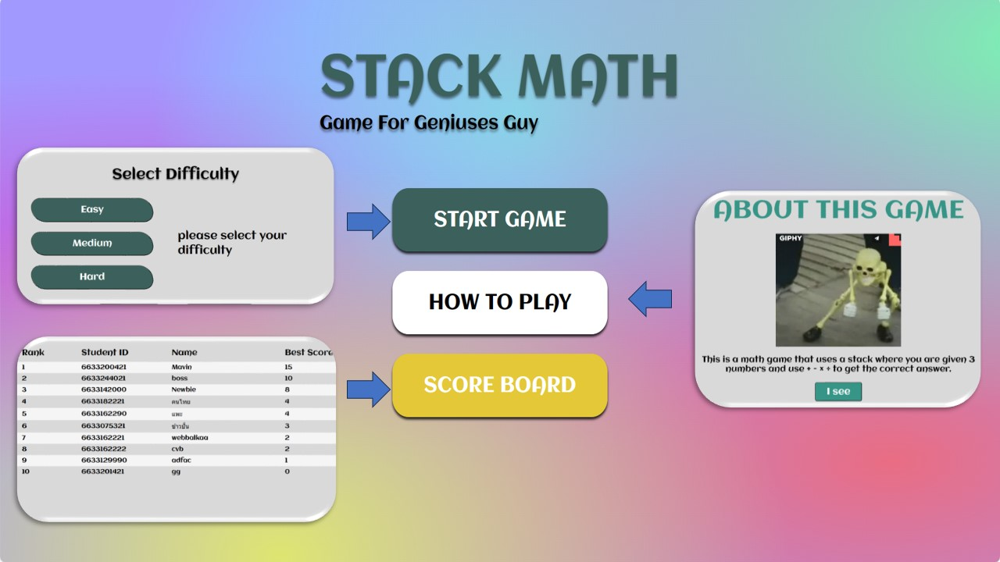
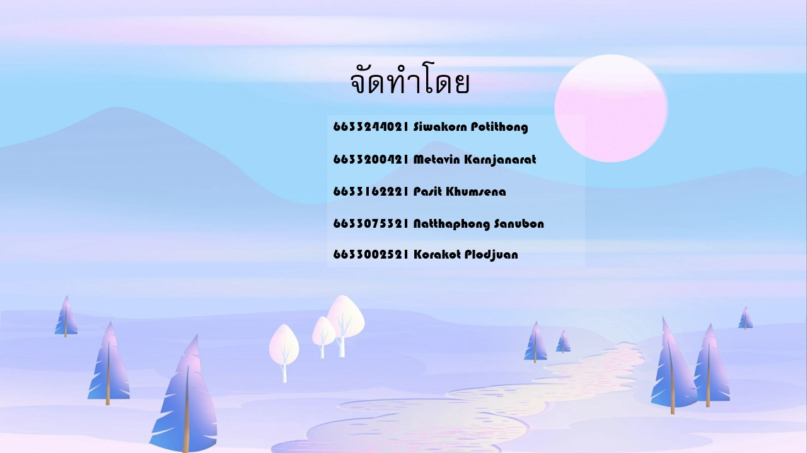

# StackMath

StackMath, a math-based educational game designed to help users practice arithmetic skills through an interactive gaming experience.

Live Demo: https://stack-math.vercel.app/

## Purpose and Scope

StackMath challenges users to solve arithmetic problems using basic operations (+, -, ×, ÷) with given numbers. The application offers multiple difficulty levels, tracks scores, and maintains a global leaderboard. This overview explains the core functionality, system architecture, and how the main components interact without delving into implementation details.

## Core Features

|Feature|Description|Implementation Location|
|---|---|---|
|Multiple Difficulty Levels|Easy, Medium, Hard problem sets|`backend/app.js:27-49`|
|Time-based Gameplay|Players solve problems against a timer|`frontend/public/index.html:90-96`|
|Score Tracking|Points awarded for correct answers|`frontend/public/index.html:97-105`|
|Global Leaderboard|Ranks players by their highest scores|`frontend/public/index.html:193-212`, `backend/app.js:51-84`|
|User Identification|Student ID and name for score submission|`frontend/public/index.html:129-137`|

## Technology Stack

|Component|Technologies|Implementation|
|---|---|---|
|Frontend|HTML, CSS, JavaScript (vanilla)|`frontend/public/index.html`, CSS files, JS modules|
|Backend|Node.js, Express.js|`backend/app.js`|
|Database|MongoDB with Mongoose ODM|`backend/app.js:3-17`|
|Deployment|Vercel|`vercel.json`|

## System Architecture

### High-Level Architecture Diagram

![[ABB526D93AD2564DBD71CED766104E72.png]]

## Frontend Components

The frontend is organized into three primary containers, each representing a different view:

|Container|Purpose|HTML Location|
|---|---|---|
|container1|Main menu, difficulty selection, game rules|`frontend/public/index.html:19-81`|
|container2|Game screen, problem display, controls|`frontend/public/index.html:82-186`|
|container3|Scoreboard display|`frontend/public/index.html:187-214`|

JavaScript logic is modularized:

- `main.js`: Application entry point and initialization
- `menu.js`: Menu navigation and screen transitions
- `game.js`: Core game mechanics, scoring, and problem handling

## Backend API

The backend exposes the following RESTful endpoints:

|Endpoint|Method|Purpose|Implementation|
|---|---|---|---|
|`/api/easy`|GET|Retrieve random easy difficulty question|`backend/app.js:27-33`|
|`/api/medium`|GET|Retrieve random medium difficulty question|`backend/app.js:35-41`|
|`/api/hard`|GET|Retrieve random hard difficulty question|`backend/app.js:43-49`|
|`/api/rank`|GET|Retrieve leaderboard rankings|`backend/app.js:51-54`|
|`/api/rank`|POST|Submit player score|`backend/app.js:56-84`|

Sources: `backend/app.js:27-84`

## User Flow

### Game Interaction Sequence Diagram

![[C43D447F451ACC107763D9D33E63694A.png]]

For more information about this repository, please 

# How to play

